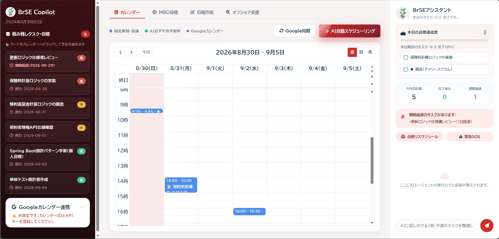

# AI PARTNER

AI PARTNERは、日本のSIerで働く **BrSE（ブリッジSE）や新人SEの業務をサポートするAIアシスタント** です。

タスク、カレンダー、学習予定を一つの画面で管理しながら、タスクの遅延確認やスケジュール調整、日報作成、オフショア成果物のレビューなど、日々の業務をAIがサポートします。

特に、新人SE・BrSEが「いつ相談すればいいか分からない」「報告文を作るのに時間がかかる」「複数のタスクをうまく整理できない」といった場面で使えることを目指して開発しました。

> **本READMEについて**
>
> 本READMEでは、AI PARTNERの目的、主な機能、基本的な操作方法について紹介します。
>
> 現在は社内ハッカソン向けの **動作プロトタイプ** です。認証・権限管理・実プロジェクトデータの永続化など、本番運用向けの機能は対象外としています。

---

## 1. 背景・解決したい課題

新人SEやBrSEは、開発作業だけでなく、タスク管理、報告、学習、お客様とのコミュニケーションなど、複数の業務を並行して進める必要があります。

特にオフショア開発では、仕様確認や成果物のレビュー、オフショアチームとお客様の間のコミュニケーションも必要になります。

| よくある場面 | 起こりうる問題 |
| --- | --- |
| タスクの期日と学習予定が重なる | 優先順位を決めにくく、対応や相談が遅れる |
| 日報やお客様への質問文の作成に時間がかかる | 本来の開発・調整業務に使える時間が減る |
| 仕様とコードの差異や、質問文の表現ミスに気づきにくい | 手戻りや認識ずれにつながる |
| 実装で行き詰まる | 相談のタイミングを逃し、一人で抱え込んでしまう |

AI PARTNERでは、こうした日々の小さな負担や見落としを減らすために、AIが状況を整理し、次に取る行動を提案します。

ただし、AIがすべてを自動で決定するのではなく、**AIが提案し、最後はユーザー自身が確認・判断する**ことを基本としています。

---

## 2. 想定ユーザー

主に以下のようなユーザーを想定しています。

| ユーザー | 利用イメージ |
| --- | --- |
| 新人SE | 今日のタスク確認、学習予定の管理、遅延時の相談、日報作成 |
| BrSE | タスク管理、お客様への質問文作成、仕様とコードの確認、オフショア成果物のレビュー |
| PM・先輩社員 | 新人やBrSEからの相談・状況共有を受ける |

デモでは、**生命保険の契約管理システム**を開発している想定で、保険料計算、契約更新、解約返戻金などの架空データを使用しています。

実在するお客様名、プロジェクトデータ、ソースコードは使用していません。

---

## 3. AI PARTNERでできること

AI PARTNERでは、主に以下の4つを一つのアプリで行えるようにしています。

### ① タスク・予定をまとめて確認

今日のタスク、期限超過タスク、プロジェクトの進捗、カレンダー、学習予定をまとめて確認できます。

### ② 遅延や問題が起きたときにAIへ相談

タスクが遅れた場合はスケジュールの再調整案を作成し、実装で行き詰まった場合は「緊急SOS」から相談内容を整理できます。

### ③ 報告・コミュニケーションをサポート

日報やPMへの相談メール、お客様への質問文など、業務で必要になる文章の下書きをAIが作成します。

### ④ オフショア成果物の確認をサポート

仕様書とコードの比較、顧客質問レビュー、テストケース・ユニットテスト生成など、BrSEのレビュー作業を支援します。

メールやお客様への連絡は自動送信しません。  
**AIが下書きを作成 → ユーザーが確認 → 必要に応じて送信**という流れにしています。

---

## 4. 画面構成

AI PARTNERのメイン画面は、3つのエリアで構成されています。



| エリア | 内容 |
| --- | --- |
| 左：ナビゲーション | 今日、カレンダー、プロジェクト、AIツール、表示設定 |
| 中央：メインエリア | タスク一覧、ダッシュボード、カレンダーなど |
| 右：タスク詳細 | 選択したタスクの期日、優先度、メモ、サブタスク |

画面右下のマスコットをクリックするとAIチャットが開きます。

タブレットやスマートフォンでは、左メニューとタスク詳細をスライド表示に切り替えます。

---

# 5. 主な機能と操作方法

## 5.1 今日のタスク

アプリを開くと、最初に「今日」の画面が表示されます。


ここでは、本日が期日のタスクと期限を過ぎているタスクをまとめて確認できます。

### 主な操作

1. 左メニューの「今日」を開きます。
2. 一覧から今日対応するタスクを確認します。
3. タスクをクリックすると、右側に詳細が表示されます。
4. 完了したタスクはチェックして完了状態に変更します。
5. 遅れているタスクがある場合は、「AIタスク自動調整」または「緊急SOS」を利用できます。

画面上部ではタスクの完了率を確認できます。

期限超過タスクがある場合は、件数と最大遅延日数が表示されるため、業務開始時に対応が必要なタスクを確認しやすくなっています。

プロジェクトでの絞り込みやキーワード検索も可能です。

---

## 5.2 プロジェクトダッシュボード

左メニューからプロジェクトを選択すると、そのプロジェクトの進捗状況を確認できます。


未着手・対応中・完了・期限超過のタスク件数に加えて、完了率や優先度別のタスク数をグラフで表示します。

### 主な操作

1. 左メニューから確認したいプロジェクトを選択します。
2. ダッシュボードで進捗状況を確認します。
3. タスク一覧から期日や優先度を変更できます。
4. 新しい作業が発生した場合は「タスク追加」から登録します。

タスクの追加・完了・期日変更を行うと、ダッシュボードのグラフにも反映されます。

---

## 5.3 タスク詳細

タスクをクリックすると、画面右側に詳細が表示されます。


タスク名、期日、優先度、メモ、サブタスクを編集できます。

### 主な操作

1. タスク一覧やカレンダーからタスクを選択します。
2. 右側の詳細画面で内容を確認・編集します。
3. 必要に応じてサブタスクやメモを追加します。
4. 作業が終わったら「完了にする」を選択します。

変更内容はブラウザ上に自動保存されます。

---

## 5.4 カレンダー

「カレンダー」では、タスク・学習予定・会議などを週単位でまとめて確認できます。


通常のタスクだけでなく、AIがおすすめする学習時間やGoogleカレンダーから取得した予定も表示できます。

### 主な操作

1. 左メニューから「カレンダー」を開きます。
2. 画面上部に表示される未完了タスクを確認します。
3. タスクをカレンダーの時間枠へドラッグ＆ドロップして予定を設定します。
4. 予定を変更したい場合は、カレンダー上でドラッグして移動します。
5. 空いている日付をクリックすると、その日を期日にしたタスクを追加できます。

遅延タスクがある場合は、「AI分析」からスケジュールの再調整もできます。

| 色 | 内容 |
| --- | --- |
| 青 | 通常タスク |
| ミント | AIが提案した学習時間 |
| グレー | 会議・打ち合わせ |
| Googleカレンダーの設定色 | Googleカレンダーから取得した予定 |

---

## 5.5 Googleカレンダー連携

カレンダー画面からGoogleカレンダーの予定を取得できます。


### 設定方法

1. カレンダー画面の設定を開きます。
2. カレンダーIDを入力します。
3. Google Calendar APIのAPIキーを入力します。
4. 設定を保存します。
5. 「Google同期」を実行します。

本日を基準に前後約1か月の予定を取得し、AI PARTNERのカレンダー上に表示します。

### 現在の制限

本プロトタイプではOAuth認証ではなく、Google Calendar APIのAPIキー方式を使用しています。

そのため、取得するGoogleカレンダーは**公開設定**になっている必要があります。

また、現在は読み取りのみ対応しており、AI PARTNERからGoogleカレンダーの予定を変更することはできません。

---

## 5.6 AIタスク自動調整

AI PARTNERの中心となる機能の一つです。

予定どおりに作業が進まなかった場合、期限を過ぎたタスクと現在の予定をAIが確認し、新しいスケジュール案を作成します。


### 操作方法

1. 「今日」画面で期限超過タスクを確認します。
2. 「AIタスク自動調整」をクリックします。
3. AIがタスクの状況を分析します。
4. 新しい期日案を確認します。
5. 必要に応じて提案されたスケジュールを採用します。

カレンダーの「AI分析」やAIチャットの「自動リスケジュール」からも同じ機能を利用できます。

### PMへの相談

スケジュール変更についてPMへの相談が必要な場合は、AIが相談メールの下書きも作成します。


内容を確認し、「PMへ相談メールを送る」からGmailの下書きを開きます。

**AIが勝手に期日を変更したり、メールを送信したりすることはありません。**

最終的な判断と送信はユーザーが行います。

---

## 5.7 緊急SOS

実装で行き詰まったときに、先輩社員やPMへ早めに相談するための機能です。


### 操作方法

1. 「緊急SOS」を開きます。
2. 現在の状況をAIが整理します。
3. AIが作成した相談文を確認します。
4. 必要に応じて内容を編集します。
5. 「PM・先輩へ送信（Gmail）」からGmailの下書きを開きます。

「もう少し自分で調べてから相談したほうがいいかもしれない」と迷っているうちに時間が経ってしまうことを防ぎ、早めに周囲へ相談するためのきっかけとして利用できます。

デモでは、保険システムの計算ロジック実装で作業が止まっているケースを想定しています。

---

## 5.8 日報作成

Gitのコミットログや作業メモから、AIが日報の下書きを作成します。


### 操作方法

1. 左メニューから「日報作成」を開きます。
2. Gitのコミットログや、その日の作業メモを入力します。
3. 「生成」を実行します。
4. AIが作成した日報を確認します。
5. 必要な部分を修正します。
6. 「上司へ報告書を送信（Gmail）」からGmailの下書きを開きます。

生成される日報は、以下の形式です。

- 本日の実施内容
- 進捗（現在の状況と次のアクション）
- 特記事項

作業ログをもとに下書きを作成することで、退勤前の日報作成にかかる時間を減らします。

---

## 5.9 オフショア支援

BrSE向けに、オフショア開発で発生しやすい確認作業をサポートする機能です。


現在、以下の3つの機能を利用できます。

### ① 仕様とコード比較

仕様書（PDF / テキスト）とソースコードを指定すると、AIが内容を比較します。

仕様との不整合だけでなく、以下のような確認ポイントも表示します。

- 認証情報の直書き
- 入力チェック不足
- 個人情報の取り扱い
- 納品後に問題となる可能性がある実装

### ② 顧客質問レビュー

母国語や簡単な日本語で入力した質問を、お客様へ確認するための自然なビジネス日本語に整えます。


また、仕様書にすでに記載されている内容を重ねて質問していないか確認し、誤解を与える可能性がある表現についても警告します。

確認後、お客様宛てのGmail下書きを開くことができます。

### ③ テスト支援

要件やソースコードをもとに、テスト作成をサポートします。

**テストケース生成**

要件・受け入れ条件から、正常系／代替系／異常系を含むテストケースを生成します。

**ユニットテスト生成**

ソースコードから、JUnit 5（Java）またはJest（JavaScript / TypeScript）のテストコードを生成します。

使用するフレームワークは自動判定することもできます。

AIの生成結果をそのまま採用するのではなく、レビュー時の確認ポイントやテスト作成のたたき台として利用することを想定しています。

---

## 5.10 WBSインポート

CSV / Excel / PDF / テキスト形式のWBSファイルを選択できます。


### 操作方法

1. 左メニューから「WBSインポート」を開きます。
2. 対象プロジェクトを選択します。
3. WBSファイルを指定します。
4. インポートを実行します。

### 現在の仕様

本機能はプロトタイプです。

ファイルサイズに応じた解析中の表示を行った後、対象プロジェクトへAPI設計、ロジック実装、単体テストなどのサンプルタスクを追加します。

**現在は実際のWBS構造を完全に解析する機能ではありません。**

正式なWBS取り込みは今後の拡張候補です。

---

## 5.11 AIチャット

画面右下のマスコットをクリックすると、AIチャットが開きます。


チャットでは、AIの処理状況を確認したり、タスクについて相談したりできます。

### 主な操作

- 「自動リスケジュール」からスケジュール調整を実行
- 「緊急SOS」から相談文を作成
- 自由入力でタスクやスケジュールについて相談

遅延タスクがある場合は再スケジュールを提案し、遅延がない場合はその旨を回答します。

---

## 5.12 表示設定

「表示設定」から、画面の見た目を変更できます。


以下の項目を設定できます。

- テーマ：ライト / ダーク / グラスモーフィズム
- アクセントカラー
- 背景画像

設定内容はブラウザに保存され、次回起動時にも反映されます。

---

## 5.13 初回表示時のあいさつ

その日初めてAI PARTNERを開くと、今日のタスク件数と一緒にあいさつ画面が表示されます。


一日の業務を始めるときに、最初に今日の状況を確認するための画面です。

---

# 6. 一日の利用イメージ

AI PARTNERは、個別のAI機能を使うだけではなく、新人SE・BrSEの一日の業務を通して利用することを想定しています。

### 朝：今日のタスクを確認

「今日」の画面を開き、今日対応するタスクや期限超過タスクを確認します。

↓

### 遅延が見つかった場合

「AIタスク自動調整」を使い、新しいスケジュール案を確認します。

必要であれば、AIが作成したメールをもとにPMへ相談します。

↓

### 実装で行き詰まった場合

「緊急SOS」を使って状況を整理し、先輩やPMへ相談します。

↓

### オフショアから成果物が届いた場合

「オフショア支援」を使い、仕様との差分、質問内容、テスト観点などを確認します。

↓

### 退勤前

Gitのコミットログや作業メモから日報を作成し、内容を確認して上司へ報告します。

このように、AI PARTNERは単にタスクを管理するだけではなく、**確認 → 判断 → 相談 → 報告**までの日々の業務をサポートします。

---

# 7. AIを利用する際の考え方

AI PARTNERでは、AIにすべてを任せるのではなく、**人が最終判断すること**を前提にしています。

| 機能 | AIが行うこと | ユーザーが行うこと |
| --- | --- | --- |
| AIタスク自動調整 | 遅延分析・期日案の作成 | 提案内容を確認して判断 |
| 緊急SOS | 状況整理・相談文作成 | 内容を確認して相談 |
| 日報作成 | 日報の下書き作成 | 修正・送信 |
| 仕様とコード比較 | 差分・リスク候補の抽出 | 指摘内容を確認 |
| 顧客質問レビュー | 日本語修正・重複確認 | お客様への送信内容を確認 |
| テスト支援 | テスト案を生成 | QA / 開発担当者が最終判断 |

**AIが提案し、人が確認して行動する。**

これをAI PARTNERの基本的な使い方としています。

---

# 8. 起動方法

## 動作環境

- Java 17以上
- Apache Maven
- Google Gemini APIキー
- Google Chromeなどのモダンブラウザ

GeminiのAPIキーは、環境変数 `GEMINI_API_KEY` に設定することを推奨します。

フロントエンドとAPIは同一プロセスで起動し、デフォルトではポート `8080` を使用します。

## 起動

```bash
cd backend
mvn spring-boot:run
```

起動後、ブラウザから以下へアクセスします。

`http://localhost:8080`

古い画面が表示される場合は、スーパーリロード（Windows：`Ctrl + F5`）を行ってください。

---

# 9. 技術構成

| 分類 | 使用技術 |
| --- | --- |
| フロントエンド | HTML5 / CSS3 / JavaScript、FullCalendar、Chart.js |
| バックエンド | Java 17、Spring Boot、Spring AI |
| 生成AI | Google Gemini |
| ファイル処理 | PDF / テキスト抽出 |
| カレンダー | Google Calendar API v3 |

### 主なAI API

- `POST /api/v1/copilot/analyze-schedule`：スケジュール再調整
- `POST /api/v1/copilot/sos-alert`：緊急SOS
- `POST /api/v1/copilot/generate-nippo`：日報生成
- `POST /api/v1/copilot/review-offshore`：オフショア支援

---

# 10. プロトタイプの対応範囲

今回のハッカソンでは、**一人の新人SE・BrSEがAI PARTNERを使って一日の業務を進めること**を中心に実装しています。

現在対応している主な範囲は以下のとおりです。

- タスク・プロジェクト・カレンダー管理
- AIによるスケジュール再調整
- 緊急SOS
- 日報生成
- オフショア支援
- Googleカレンダーからの予定取得
- Gmail下書き画面との連携

一方、以下の機能は今回の対象外としています。

- ログイン・権限管理・監査ログ
- 複数ユーザーでのリアルタイム共有
- Jiraなどとの双方向同期
- WBSファイルの完全な解析
- Googleカレンダーへの書き込み
- OAuthを利用した非公開Googleカレンダーとの連携
- 実在するお客様の機密情報を利用したAI処理・データ保管

また、APIキーを設定ファイルへ直接記載した状態で公開リポジトリへプッシュしないでください。

提出・保管する場合は、環境変数を利用してください。

---

# 11. デモについて

デモでは、生命保険の契約管理システムを想定した架空データを使用しています。

おすすめの操作順は以下です。

**今日のタスク  
→ 期限超過を確認  
→ AIタスク自動調整  
→ カレンダー  
→ 緊急SOS  
→ オフショア支援  
→ 日報作成**

この順番で操作すると、新人SE・BrSEが一日の中でAI PARTNERをどのように利用するか確認できます。

実案件の仕様書、ソースコード、お客様情報などの機密データはアップロードしないでください。

---

## 最後に

AI PARTNERは、AIに仕事を任せるためのツールではありません。

タスクが遅れたとき、実装で困ったとき、報告や相談が必要になったときに、AIが状況整理や下書きをサポートし、**ユーザー自身が次の行動を決めやすくすること**を目指しています。

**AIと一緒に、仕事を進める。**

それが、AI PARTNERです。